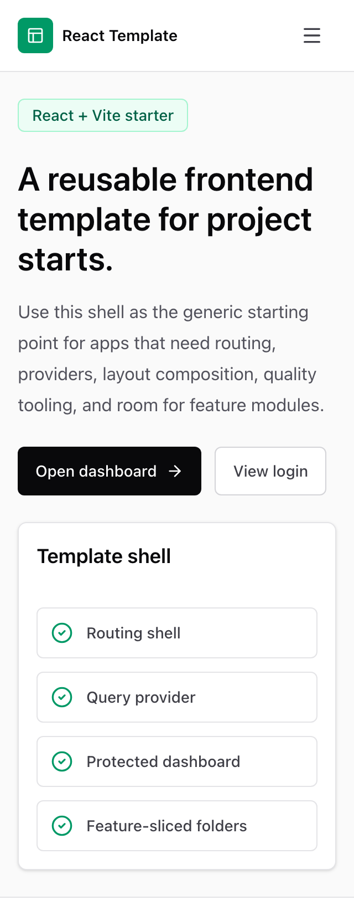
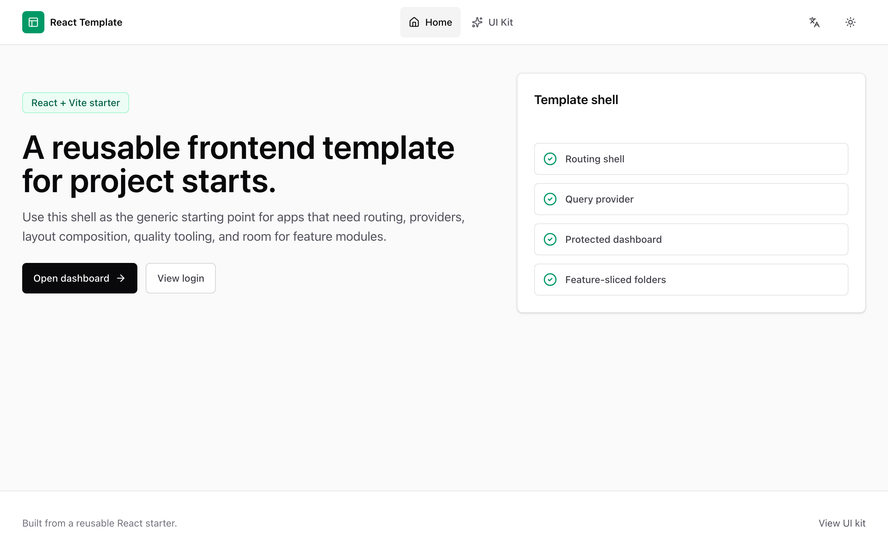
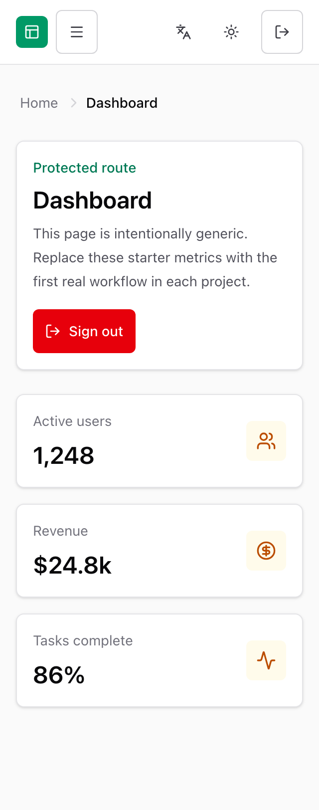
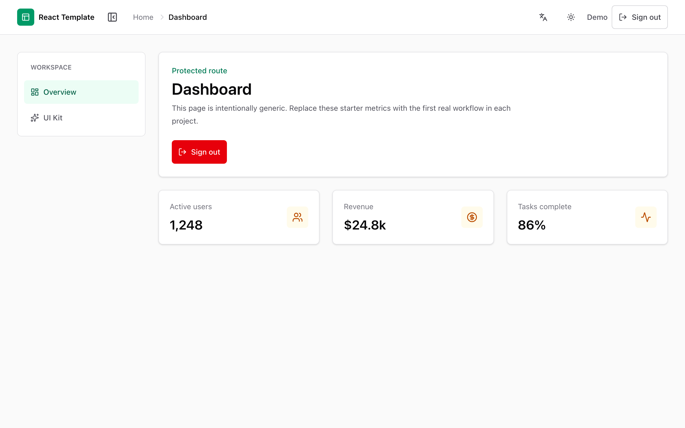
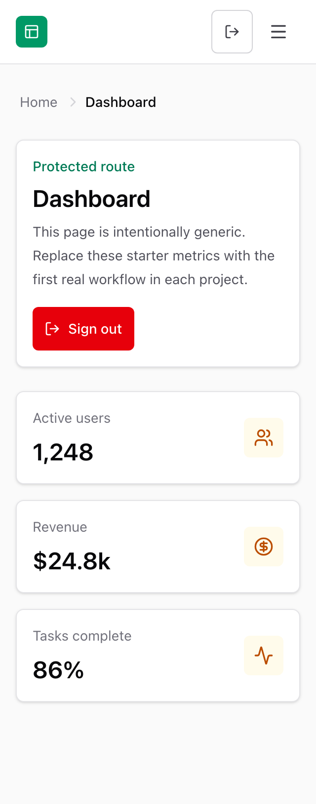
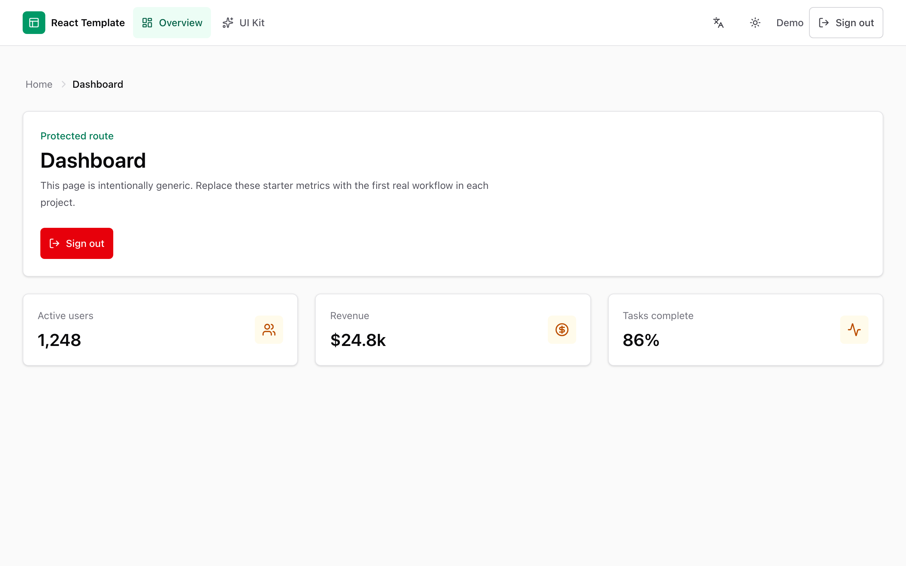

# React Template

A reusable React starter built with Vite, TypeScript, Tailwind CSS, React Router,
TanStack Query, Zustand, Axios, React Hook Form, Zod, Vitest, ESLint, Prettier,
Husky, and lint-staged.

This template is intentionally generic. It includes a mock auth flow, dashboard
shell, routing, shared API/client utilities, basic UI primitives, testing, linting,
formatting, and a feature-sliced folder architecture.

## Use This Template

Click **Use this template** on GitHub to create your own repository, clone it,
then run:

```bash
nvm use            # picks Node from .nvmrc (24)
npm install
npm run init       # rename the project (prompts for a name)
# pick a shell:
# npm run init -- --name="My App" --layout=dashboard-topnav
# or skip demos:
# npm run init -- --name="My App" --clean --layout=marketing
# or also strip translations:
# npm run init -- --name="My App" --no-i18n
```

`npm run init` rewrites the package name, page title, env defaults, and the
auth storage key, then lets you choose a layout preset. Pass
`--layout=marketing`, `--layout=dashboard-sidebar`, or
`--layout=dashboard-topnav` to skip the prompt. With `--clean` it deletes the
unused layout widgets and rewrites the router/barrels for the selected preset.
With `--no-i18n` it uninstalls react-i18next, deletes the i18n config /
direction hook / language switcher, and rewrites every `t('foo.bar')` back to
its English literal so the app builds without translations — run `npm install`
afterwards to drop the packages from `node_modules`.

## Choose Your Layout

The template ships three layout presets behind a compile-time switch in
`src/shared/config/layout.ts`. Default is `dashboard-sidebar`; no-clean projects
keep all layout widgets so you can change the constant later.

| Preset            | 320px preview                                                                              | 1280px preview                                                                               |
| ----------------- | ------------------------------------------------------------------------------------------ | -------------------------------------------------------------------------------------------- |
| Marketing         |                  |                  |
| Sidebar dashboard |  |  |
| Topnav dashboard  |    |    |

Preset cleanup examples:

```bash
npm run init -- --name="My App" --clean --layout=marketing
npm run init -- --name="My App" --clean --layout=dashboard-sidebar
npm run init -- --name="My App" --clean --layout=dashboard-topnav
```

## Start Development

```bash
npm install
cp .env.example .env
npm run dev
```

## Feature Docs

Per-feature usage guides live in [docs/](docs/README.md):

- [i18n & RTL](docs/i18n.md) — translations, language switcher, RTL,
  and the `--no-i18n` opt-out.
- [Routing & Layout](docs/routing-and-layout.md) — lazy routes, error
  boundaries, responsive layout presets, and auth-aware dashboard shells.
- [Build & Performance](docs/build-and-performance.md) — SVG components,
  `build:analyze`, vendor chunk pinning, the bundle-size budget, and
  PWA opt-in.
- [Testing](docs/testing.md) — Vitest + MSW setup, coverage,
  backend-free dev with `VITE_ENABLE_MSW=true`, and Playwright for E2E.
- [Monitoring & Analytics](docs/monitoring.md) — no-op capture helpers and
  swap-in notes for Sentry, PostHog, and Plausible.
- [CI/CD](docs/ci-cd.md) — the CI pipeline, CodeQL scanning, and the
  parked deploy template for Vercel / Netlify / GitHub Pages.

## Quality Checks

```bash
npm run format
npm run lint
npm run type-check
npm run test:run
npm run build
```

## Scripts

```txt
npm run dev           Start Vite dev server
npm run build         Type-check and build for production
npm run build:analyze Build with the rollup-plugin-visualizer treemap
npm run size:check    Fail if any dist chunk exceeds the gzip budget
npm run preview       Preview the production build
npm run lint          Run ESLint
npm run lint:fix      Run ESLint with auto-fix
npm run type-check    Run TypeScript without emitting files
npm run format        Format files with Prettier
npm run format:check  Check Prettier formatting
npm run test          Run Vitest in watch mode
npm run test:run      Run Vitest once
npm run test:coverage Run Vitest once with a v8 coverage report
```

## What's in the Box

| Area           | Included                                                                                                                                                                                                                             |
| -------------- | ------------------------------------------------------------------------------------------------------------------------------------------------------------------------------------------------------------------------------------ |
| Framework      | React 19, Vite, TypeScript (strict)                                                                                                                                                                                                  |
| Styling        | Tailwind v4, `cn()` helper, light / dark / system theme with no-FOUC inline script                                                                                                                                                   |
| Routing        | React Router v7, lazy routes, route + top-level `ErrorBoundary`, `ScrollToTop`, `RoleGuard`, breadcrumbs, `/session-expired`                                                                                                         |
| State          | Zustand (mock auth store) with `persist` middleware                                                                                                                                                                                  |
| Data layer     | Axios with request / response interceptors (Bearer token, 401 → `/session-expired`), TanStack Query defaults, `parseApiError`, `useApiMutation`                                                                                      |
| Forms          | React Hook Form + Zod, `<FormField>` wrapper, `useZodForm`, shared validators, drag-and-drop `FileUpload`                                                                                                                            |
| UI primitives  | ~25 headless components in `src/shared/ui` (Dialog / Tabs / Tooltip / DropdownMenu via Radix; rest custom) plus a live `/ui-kit` demo view                                                                                           |
| Feedback       | `sonner` toasts, `useConfirm()` promise-based dialog, `ErrorFallback` + dedicated `/error` view                                                                                                                                      |
| Hooks          | `useDebounce`, `useDebouncedCallback`, `useLocalStorage`, `useMediaQuery`, `useBreakpoint`, `useIsMobile`, `useDisclosure`, `useCopyToClipboard`, `useIsMounted`, `useOnClickOutside`, `usePagination`, `usePrevious`, `useInterval` |
| i18n / RTL     | i18next + react-i18next, EN / AR resources, language switcher, `useDirection()`, configurable `DEFAULT_LANGUAGE` / `FALLBACK_LANGUAGE`                                                                                               |
| Architecture   | Feature-Sliced layers (`app` → `views` → `widgets` → `features` → `entities` → `shared`) enforced by `eslint-plugin-boundaries`                                                                                                      |
| Testing        | Vitest + Testing Library + MSW (tests **and** `VITE_ENABLE_MSW=true` dev), coverage via `npm run test:coverage`                                                                                                                      |
| Build & perf   | rolldown-vite, `vite-plugin-svgr`, `rollup-plugin-visualizer`, pinned vendor chunks, `npm run size:check` gzip budget                                                                                                                |
| Layout presets | Three compile-time presets — `marketing`, `dashboard-sidebar`, `dashboard-topnav` — switchable via `src/shared/config/layout.ts` or `--layout=`                                                                                      |
| Responsive     | Mobile-first defaults, `<Container>`, `BreakpointIndicator` (dev-only), 44 × 44 px touch targets, mobile drawer pattern documented                                                                                                   |
| Monitoring     | Vendor-neutral `captureError` / `captureEvent` seam (no SDK installed)                                                                                                                                                               |
| CI / CD        | GitHub Actions: format → lint → type-check → test → build → bundle-size; CodeQL weekly; Dependabot; parked Vercel / Netlify / GH Pages deploy job                                                                                    |
| DX             | Husky + lint-staged + commitlint, EditorConfig, VS Code recommendations, PR / issue templates, CODEOWNERS stub, `npm run init` rename script                                                                                         |

## What We Deliberately Left Out

These are common asks that we **intentionally** don't ship — install them in
the consuming project when you actually need them, so the template stays
dependency-light and unopinionated.

- **Heavier shadcn/ui components (DataTable, Combobox, Calendar, Command,
  Chart, etc.).** The template ships the everyday primitives (Button, Input,
  Dialog, Dropdown, Tooltip, Tabs, Table primitives, …) directly in
  [src/shared/ui](src/shared/ui). For anything bigger or more opinionated, a
  preconfigured [`components.json`](components.json) is included so
  `npx shadcn@latest add <component>` drops the file into `src/shared/ui/`
  with the right aliases, base color, and Tailwind v4 setup — no init step
  needed. Heads-up: running `add` for a component that already exists will
  overwrite the customized version, so use it for net-new additions.
- **Sentry / PostHog / Plausible / any analytics SDK.**
  [src/shared/lib/monitoring.ts](src/shared/lib/monitoring.ts) is a no-op
  seam — `registerMonitoring()` from your app once you pick a vendor. Keeps
  bundles clean by default.
- **Playwright (or any E2E framework).** Heavy and opinionated. Recommended
  per-project; see [docs/testing.md](docs/testing.md).
- **`vite-plugin-pwa` / service workers.** Opt-in per project; documented in
  [docs/build-and-performance.md](docs/build-and-performance.md).
- **A real backend or auth provider.** Auth is mock-only (Zustand + persisted
  `localStorage`). Replace with backend-owned sessions and `httpOnly` cookies
  before shipping anything real.
- **Storybook.** The `/ui-kit` demo view covers the same "render every
  primitive" need at near-zero cost. Add Storybook later if a project needs
  full design-system tooling.
- **TanStack Table / TanStack Form / TanStack Router.** The shipped `<Table>`
  primitives cover static tables, RHF + Zod covers forms, and React Router
  fits most apps — upgrade per-project when sorting/filtering/virtualization
  or richer form/router needs appear.
- **release-please / semantic-release / changesets.** `commitlint` is wired,
  but release automation is project-specific.
- **State libraries beyond Zustand.** No Redux Toolkit, Jotai, Recoil, etc.
  The auth store demonstrates the pattern; add what the project actually
  needs.
- **`LICENSE` choices besides MIT.** The template ships MIT; swap it out per
  project if your team prefers Apache-2.0, BSL, proprietary, etc.

## Architecture

```txt
src/
  app/       App bootstrapping, providers, and router
  views/     Route-level screens
  widgets/   Large composed UI blocks
  features/  User actions and business flows
  entities/  Business models and reusable entity types
  shared/    Generic reusable code, config, API clients, libs, and UI
  test/      Test setup and test utilities
```

Layer rules:

- `shared` contains reusable generic code.
- `entities` contains business models.
- `features` contains user actions and business flows.
- `widgets` contains larger UI blocks composed from lower layers.
- `views` contains route-level screens.
- `app` contains providers, router, and app bootstrapping.

ESLint boundaries enforce this dependency direction.

## Environment

Copy `.env.example` to `.env`:

```bash
cp .env.example .env
```

Available variables:

```txt
VITE_APP_NAME
VITE_API_BASE_URL
VITE_ENABLE_MSW
VITE_SENTRY_DSN
VITE_ANALYTICS_KEY
```

`VITE_API_BASE_URL` should be empty for the default `/api` fallback or set to a
full URL such as `http://localhost:3000/api`.

Set `VITE_ENABLE_MSW=true` in `.env.local` to boot the dev server behind
the MSW mock worker — useful for building UI before a backend exists. The
flag is ignored in production builds. See [docs/testing.md](docs/testing.md)
for details.

`VITE_SENTRY_DSN` and `VITE_ANALYTICS_KEY` are placeholders for projects that
opt into monitoring or analytics. They are parsed by `src/shared/config/env.ts`,
but the template does not install or initialize any vendor SDK by default.

## Monitoring & Analytics

The template exposes vendor-neutral capture helpers from
`src/shared/lib/monitoring.ts`:

```ts
import { captureError, captureEvent, registerMonitoring } from '@/shared/lib'

captureEvent('Dashboard Viewed', { source: 'navbar' })
captureError(error, { source: 'react-error-boundary' })
```

The default adapter is a no-op, so builds stay dependency-free. To wire a real
provider, install the SDK in the app project and call `registerMonitoring()`
during app startup. The route error boundary and Axios response interceptor
already call `captureError()`. See [docs/monitoring.md](docs/monitoring.md) for
Sentry, PostHog, and Plausible examples.

## Theming (Light / Dark / System)

The template ships a `ThemeProvider` backed by `localStorage` (key
`react-template:theme`) and a `ThemeToggle` widget in the navbar. The provider
applies the `.dark` class to `<html>`; primitives use Tailwind `dark:` variants.

```ts
import { useTheme } from '@/shared/lib'

const { theme, resolvedTheme, setTheme } = useTheme()
//      ^ 'light' | 'dark' | 'system'    ^ 'light' | 'dark'
```

A small inline script in [index.html](index.html) reads the stored preference
before first paint, so there is no flash of the wrong theme on reload. If you
change the storage key, change it in both files (the rename script does this
automatically).

## Mock Auth

The included auth flow is mock/demo-only. It uses:

- React Hook Form and Zod for validation
- a mock login request
- Zustand for auth state
- Zustand persist with `localStorage` for demo persistence

The persisted key is:

```txt
react-template:auth
```

Do not treat this as production token storage. Real projects should replace mock
auth with backend-owned session handling. Prefer secure `httpOnly` cookies for
refresh/session tokens and short-lived access tokens. Do not store sensitive
tokens, API keys, permissions, or sensitive user data in `localStorage`.

## UI

The template stays UI-light. It includes minimal local primitives:

```txt
Button
Input
Card
FormError
LoadingScreen
```

To add shadcn/ui in a real project later:

```bash
npx shadcn@latest init
npx shadcn@latest add button input label card form sonner
```

Configure shadcn to output components into `src/shared/ui` if you want to keep
the same architecture.

## Responsive Patterns

The template is mobile-first. Default classes should render cleanly at 320px
and Tailwind breakpoint prefixes should only opt up as space increases.

Tailwind's default breakpoints are the source of truth:

```txt
sm   640px
md   768px
lg   1024px
xl   1280px
2xl  1536px
```

Use `md` as the layout breakpoint. Sidebars collapse into drawers, navbars
switch to hamburger drawers, and multi-column grids should stack below `md`.
Keep every interactive target at least 44 x 44px; the shared `Button` sizes,
icon buttons, dropdown items, tabs, switches, and form controls follow that
baseline.

Use these class rhythms unless a project has a clear reason to diverge:

```tsx
<h1 className="text-2xl sm:text-3xl lg:text-4xl">Page title</h1>
<p className="text-base lg:text-lg">Readable prose</p>
<section className="grid gap-4 lg:gap-6 p-4 sm:p-6 lg:p-8" />
```

Prefer the shared `<Container>` for page-width content:

```tsx
import { Container } from '@/shared/ui'

function Layout() {
  return (
    <Container as="main" className="py-6 sm:py-8 lg:py-10">
      <Outlet />
    </Container>
  )
}
```

Responsive code can read the current viewport using the shared hooks:

```tsx
import { useBreakpoint, useIsMobile, useMediaQuery } from '@/shared/lib'

const breakpoint = useBreakpoint() // 'base' | 'sm' | 'md' | 'lg' | 'xl' | '2xl'
const isMobile = useIsMobile() // max-width: 767px
const canHover = useMediaQuery('(hover: hover) and (pointer: fine)')
```

The canonical drawer pattern for mobile navigation is a Radix Dialog mounted
below `md`: keep the desktop layout visible at `md+`, render a `Button
size="icon"` or labeled 44px trigger below `md`, close the drawer on route
change, and use logical `start` / `end` positioning so RTL layouts slide from
the correct side.

Tooltips are disabled on coarse touch pointers by default because hover is not
reliable there. Tabs use horizontal overflow, pagination drops sibling pages
below `sm`, and tables keep their own `overflow-auto` wrapper.

## Start A New Project

After this repository is pushed and marked as a GitHub template, use GitHub's
`Use this template` button or clone without history:

```bash
npx degit YOUR_USERNAME/react-template my-new-project
cd my-new-project
npm install
cp .env.example .env
npm run dev
```
